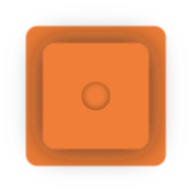

<p align="center">
  <a href="https://handgesture.ru">
    
  </a>
</p>
<p align="center">
    <a href="https://handgesture.ru">View Demo</a>
</p>

## О проекте

[![Hand Game Screen Shot][product-screenshot]](https://handgesture.ru)

Мини игра в которой нужно повторять жесты на картинке

Можно позвать друга и соревноваться в наборе очков

## Использовано

- [![React][React.js]][React-url]
- [![Next][Next.js]][Next-url]
- [![Nest][Nest.js]][Nest-url]
- [![ONNXRuntime][ONNXRuntime.ai]][ONNXRuntime-url]
- [![Docker][docker.com]][Docker-url]

## Локальный запуск

```sh
git clone https://github.com/Gerpea/hand_game.git
cd hand_game
```

```sh
docker-compose -f docker-compose.prod.yml build
docker-compose -f docker-compose.prod.yml up
```

Приложение будет доступно по адресу `http://localhost:80`

## Разработка

```sh
nvm use
```

```sh
npm run packages:build
npm run packages:link
npm run client:link
```

```sh
npm ci
```

```sh
npm run server:dev
```

Сервер будет доступен по адресу `http://localhost:3000`

```sh
npm run client:dev
```

Клиент будет доступен по адресу `http://localhost:8080`

### Сбор картинок для датасета

[![Hand Game Dev Screen Shot][product-dev-screenshot]](http://localhost:8080/dev)

Перейти на `http://localhost:8080/dev`

- Показать жест на картинке
- Нажать на пробел
- Повторять пока не наберется нужное количество картинок

После нажать кнопку `Save samples`, картинки сохранятся в папку для загрузок

Для обучения класификатора перейти в папку [recognition/classification](recognition/classification) и следовать инструкции

> Лучше не сохранять за раз слишком много картинок, тк они хранятся в RAM

[product-screenshot]: readme/preview.png
[product-dev-screenshot]: readme/dev.png
[Next.js]: https://img.shields.io/badge/Next.js-000000.svg?style=for-the-badge&logo=nextdotjs&logoColor=white
[Next-url]: https://nextjs.org/
[React.js]: https://img.shields.io/badge/React-61DAFB.svg?style=for-the-badge&logo=React&logoColor=black
[React-url]: https://reactjs.org/
[Nest.js]: https://img.shields.io/badge/NestJS-E0234E.svg?style=for-the-badge&logo=NestJS&logoColor=white
[Nest-url]: https://nestjs.com/
[ONNXRuntime.ai]: https://img.shields.io/badge/ONNX-005CED.svg?style=for-the-badge&logo=ONNX&logoColor=white
[ONNXRuntime-url]: https://onnxruntime.ai/
[Docker.com]: https://img.shields.io/badge/Docker-2496ED.svg?style=for-the-badge&logo=Docker&logoColor=white
[Docker-url]: https://www.docker.com/
